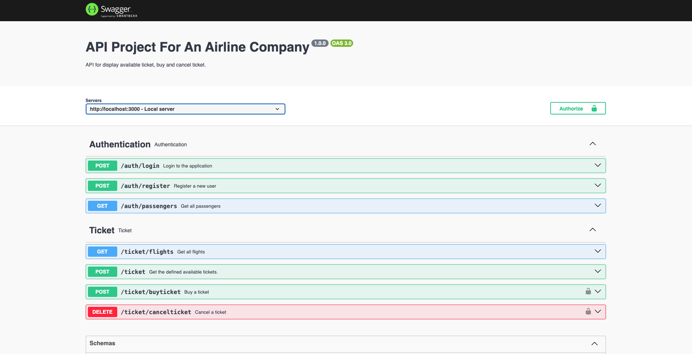

# Airline Management System

The project appears to be a web application built using Node.js and Express, with a focus on handling flight-related operations such as ticket booking, cancellation, and flight information retrieval. The application includes user authentication to manage passenger accounts.

## Table of Contents

- [Introduction](#introduction)
- [Installation](#installation)
  - [Configure Environment Variables](#configure-environment-variables)
- [Project Structure](#project-structure)
- [Source Code Examples](#source-code-examples)
  - [Verify Token (ticketRoute.js)](#verify-token-ticketroutejs)
  - [CORS (index.js)](#cors-indexjs)
- [Example Usage (Swagger UI)](#example-usage-swagger-ui)
- [API Routes](#api-routes)
  - [Authentication](#authentication)
  - [Ticket](#ticket)
- [Interactions with the Application](#interactions-with-the-application)
- [Database](#database)
  - [Passenger Table](#passenger-table)
  - [Flights Table](#flights-table)
  - [Tickets Table](#tickets-table)
- [Example Interaction Flow](#example-interaction-flow)
  - [User Registration](#user-registration)
  - [User Login](#user-login)
  - [Booking a Ticket](#booking-a-ticket)
  - [Canceling a Ticket](#canceling-a-ticket)
- [Database Schema (ER Diagram)](#database-schema-er-diagram)
- [Dependencies](#dependencies)

## Introduction

This project aims to provide a streamlined solution for managing flight-related operations, offering a user-friendly interface for passengers to book and cancel tickets securely. The system incorporates user authentication to ensure data privacy and personalize the user experience.

1. Flight Ticket Booking:

   - Users can easily browse available flights, view ticket prices, and book tickets for specific dates and routes.

   - The system optimizes the booking process by considering the number of available seats and ensuring that booked tickets do not exceed the capacity of each flight.

2. User Authentication:

   - The project prioritizes user security by implementing a robust authentication system. Users can register for an account, providing a personalized experience and enabling secure access to their booking history.

3. Efficient Ticket Management:

   - The application facilitates both ticket purchases and cancellations, ensuring that users have control over their bookings.

   - The system automatically updates the availability of seats based on successful transactions, preventing overbooking and ensuring accurate flight information.

4. Database-Driven Approach:

   - Leveraging a Microsoft SQL Server database, the project maintains structured data for passengers, flights, and tickets.

   - SQL queries are utilized to interact with the database, providing a reliable and efficient means of managing data.

In summary, the project serves as a comprehensive solution for individuals seeking a straightforward and secure platform to manage their flight reservations, with an emphasis on usability and data integrity.

## Installation

To set up and run this project locally, follow these steps:

### Prerequisites

Make sure you have the following tools installed on your machine:

- [Node.js](https://nodejs.org/): Ensure you have Node.js installed (version 14 or higher).

### Clone the Repository

```bash
git clone https://github.com/alperengokbak/Airline-Management-System

# Navigate to the project directory
cd Airline-Management-System

# Install dependencies
npm install

# Run the project (You can change the start script in package.json)
npm start
```

### Configure Environment Variables

Create a .env file in the project root.
Define the following variables in the .env file:

```env
PORT=3000
SECRET_KEY=your_secret_key
APPLICATIONINSIGHTS_CONNECTION_STRING=your_application_insights_connection_string
DATABASE_CONNECTION_STRING=your_database_connection_string
# Add other environment variables as needed
```

## Project Structure

The project is structured as follows:

```bash
.src
├── controllers
│   ├── authController.js
│   └── ticketController.js
├── db
│   └── dbConfig.js
├── routes
│   ├── authRoute.js
│   └── ticketRoute.js
```

## Source Code Examples

### Verify Token (ticketRoute.js)

The verifyToken function is used to authenticate users and verify their access tokens.

```javascript
const verifyToken = (req, res, next) => {
  if (!req.header("Authorization")) {
    return res.status(401).json({ status: "Unauthorized" });
  }
  const token = req.header("Authorization").split(" ")[1];
  if (!token) return res.status(401).json({ error: "Unauthorized" });

  jwt.verify(token, process.env.SECRET_KEY, (err, user) => {
    if (err) return res.status(403).json({ error: "Forbidden" });
    req.user = user;
    next();
  });
};
```

## CORS (index.js)

The CORS middleware is used to enable CORS for all routes.

```javascript
// Import express and swaggerUi
import express from "express";

// Import cors
import cors from "cors";

const app = express(); // Create an express application
const port = process.env.PORT;

app.use(express.json()); // Use JSON parsing middleware for incoming requests
app.use(cors()); // Enable CORS (Cross-Origin Resource Sharing) for the application
```

## Example Usage (Swagger UI)

The project is hosted on Microsoft Azure at [Airline Managment System](https://airlinemanagmentsystem.azurewebsites.net).

You can use the Swagger UI to interact with the API endpoints.



## API Routes

### Authentication

1. #### `POST /auth/login`

   Endpoint to authenticate a user.

   ##### Request

   ```json
   {
     "username": "test",
     "password": "12345"
   }
   ```

   ##### Response

   ```json
   {
     "status": "Success",
     "passenger": {
       "passengerId": 4,
       "username": "test",
       "fullName": "test test"
     },
     "accessToken": "your-access-token"
   }
   ```

2. #### `POST /auth/register`

   Endpoint to register a new user.

   ##### Request

   ```json
   {
     "username": "newuser",
     "password": "newpassword",
     "fullName": "New User"
   }
   ```

   ##### Response:

   ```json
   {
     "status": "Success"
   }
   ```

### Ticket

1. #### `POST /ticket`

   Endpoint to display available tickets.

   ##### Request:

   ```json
   {
     "date": "2023-12-01",
     "fromLocation": "New York",
     "toLocation": "Los Angeles",
     "numberOfPeople": 1
   }
   ```

   ##### Response:

   ```json
   [
     {
       "FlightId": 1,
       "Date": "2023-12-01",
       "FlightNumber": "FL123",
       "Price": 100,
       "AvailableSeats": 50
     }
   ]
   ```

2. #### `GET /ticket/flights`

   Endpoint to display all flights.

   ##### Response:

   ```json
   [
     {
       "FlightId": 1,
       "Date": "2023-12-01",
       "FlightNumber": "FL123",
       "Price": 100,
       "AvailableSeats": 50
     }
   ]
   ```

3. #### `POST /ticket/buyticket`

   Endpoint to buy a ticket. Requires authentication.

   ##### Request:

   ```json
   {
     "date": "2023-12-01",
     "fromLocation": "CityA",
     "toLocation": "CityB",
     "fullName": "John Doe"
   }
   ```

   ##### Response:

   ```json
   {
     "status": "Success"
   }
   ```

   4. #### `DELETE /ticket/cancelticket`

   Endpoint to cancel a ticket. Requires authentication.

   ##### Request:

   ```json
   {
     "flightNumber": "FL123",
     "passengerId": 1
   }
   ```

   ##### Response:

   ```json
   {
     "status": "Success"
   }
   ```

## Database

The project uses a Microsoft SQL Server database to store essential information about passengers, flights, and tickets. Below is an example representation of the database structure:

### Passenger Table

| PassengerId | Username      | Password | FullName       |
| ----------- | ------------- | -------- | -------------- |
| 1           | alperengokbak | 12345    | Alperen Gokbak |
| 2           | test          | 12345    | test test      |

### Flights Table

| FlightId | Date       | FlightNumber | Price | AvailableSeats |
| -------- | ---------- | ------------ | ----- | -------------- |
| 1        | 2023-12-01 | AB123        | 100   | 149            |
| 2        | 2023-12-01 | FL456        | 200   | 100            |

### Tickets Table

| TicketId | PassengerId | FlightId |
| -------- | ----------- | -------- |
| 1        | 1           | 1        |
| 2        | 2           | 2        |

## Interactions with the Application

### Authentication (authController.js)

- The login function queries the Passenger table to verify the existence of a user with the provided username and compares the hashed password.

- The register function inserts a new passenger record into the Passenger table, hashing the provided password.

### Flights Information (ticketController.js)

- The displayAllFlights function retrieves all flight information from the Flights table, providing a list of available flights.

### Ticket Booking (ticketController.js)

- The displayTicket function queries the Flights table based on specified parameters (date, from location, to location, number of people) to display available tickets.

- The buyTicket function involves multiple queries:
  - It retrieves the PassengerId and FlightId based on the provided fullName, date, fromLocation, and toLocation.
  - It checks the availability of seats for the selected flight and inserts a new record into the Tickets table.
  - It updates the AvailableSeats in the Flights table.

### Ticket Cancellation (ticketController.js)

- The cancelTicket function retrieves the FlightId based on the provided flightNumber.

- It then retrieves the TicketId based on the FlightId and PassengerId and deletes the corresponding record from the Tickets table.

- It updates the AvailableSeats in the Flights table.

## Example Interaction Flow

### User Registration

1. User registers with a username, password, and full name.
2. The register function inserts a new record into the Passenger table.

### User Login

1. User logs in with a username and password.
2. The login function queries the Passenger table to authenticate the user.

### Booking a Ticket

1. User requests available tickets for a specific date, from location, to location, and number of people.

2. The displayTicket function queries the Flights table and returns a list of available flights.

3. User selects a flight and provides necessary details.

4. The buyTicket function inserts a new record into the Tickets table and updates the AvailableSeats in the Flights table.

### Canceling a Ticket

1. User requests to cancel a booked ticket.

2. The cancelTicket function retrieves the necessary information from the Flights and Tickets tables.
3. It deletes the ticket record and updates the AvailableSeats in the Flights table.

## Database Schema (ER Diagram)


## Dependencies

List the main dependencies and their versions used in the project.

- express: ^4.18.2

  - Express is a fast, unopinionated, minimalist web framework for Node.js.

- msnodesqlv8: ^4.1.2

  - The msnodesqlv8 package provides a Microsoft SQL Server ODBC driver for Node.js, allowing interaction with SQL Server databases.

- jsonwebtoken: ^9.0.2

  - JSON Web Token (JWT) is a compact, URL-safe means of representing claims between two parties. This package is used for creating and verifying JWTs.

- bcrypt: ^5.1.1

  - Bcrypt is a password-hashing function designed to be slow and resilient against brute-force attacks. It's used for securely hashing user passwords.

- dotenv: ^16.3.1

  - Dotenv is a zero-dependency module that loads environment variables from a .env file into process.env. It's often used for managing configuration in Node.js applications.

- yamljs: ^0.3.0

  - YAML (YAML Ain't Markup Language) is a human-readable data serialization format. The yamljs package allows for parsing and stringifying YAML data in JavaScript.

- cors: ^2.8.5

  - CORS (Cross-Origin Resource Sharing) is a security feature implemented by web browsers. The cors package simplifies the process of handling CORS headers in an Express application.

- swagger-ui-express: ^5.0.0

  - Swagger UI Express is a middleware to serve Swagger UI on the specified path, making it easy to visualize and interact with your API's resources.

- applicationinsights: ^2.9.1

  - Application Insights is an extensible Application Performance Management (APM) service for web developers. The applicationinsights package allows integrating Application Insights with Node.js applications.

- nodemon: ^3.0.1

  - Nodemon is a utility that monitors for changes in files and automatically restarts the Node.js application. It's commonly used during development to streamline the development workflow.
